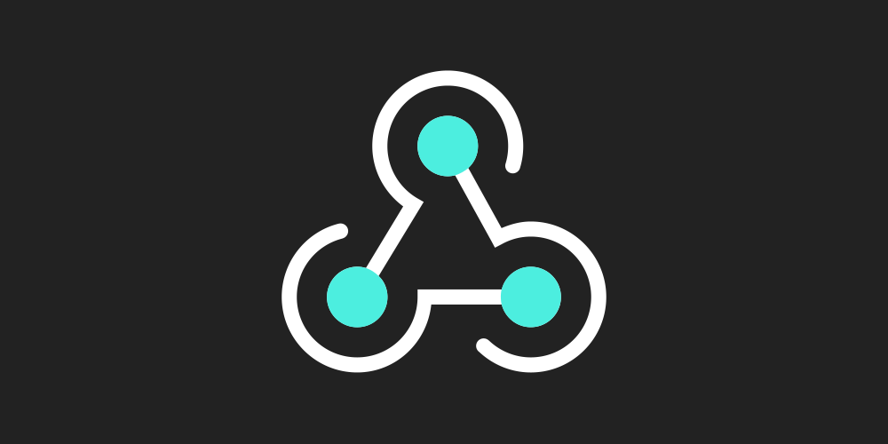

    

# 环境
    cvat server: 2.4.1
    python >= 3.8
    pip install -r requirements.txt
# 说明
- 入口文件: `main.py`

- 配置文件: `config.py`

- 根据task_id/project_id 获取具体信息文件: `get_data_info.py`

- 根据cvat webhook 中 `event` 分类然后手动解析字段并转发

- 如有其他问题请联系我, Q : `1973735972`